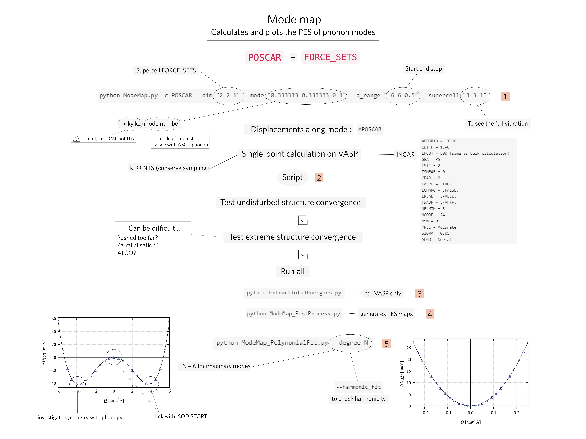

# ModeMap Workflow
## Purpose
This workflow is designed to help you get started, or improve your workflow using ModeMap to analyse potential energy surfaces of phonon modes.

## Requirements
- You must have calculated FORCE_SETS from phonopy previously, see [phonopy](../phonopy) for help.
- You must have `ModeMap.py`, `ExtractTotalEnergies.py`, `ModeMap_PostProcess.py`, and `ModeMap_PolynomialFit.py` in your main directory, see [ModeMap](https://github.com/JMSkelton/ModeMap).

## Usage 
### Mind Map
A typical workflow looks like this:

### Scripts
Using the scripts it gives a five step worklow - each step is highlighted on the mind map:
1. `structures.sh` runs `ModeMap.py` for all the MODEs of interest and untar MODEMAP.tar.gz, which contains all the MPOSCARs. 
2. `singlepoint_norun.sh` and `singlepoint_run.sh` distributes all MPOSCARs into single directories with INCAR, KPOINTS, POTCAR, and job script files. I recommend starting with `singlepoint_norun.sh` and then test that calculations are well converged before using `run.sh`, which is specifically designed to run single point calculations for all structures apart from the undisturbed and extreme ones.
3. `energies.sh` runs `ExtractTotalEnergies.py` for all MODEs and cleans irrelevant files from all sub-directories. 
4. `postprocess.sh` runs `ModeMap_PostProcess.py` for all MODEs and creates the directory Results, which stores the potential energy surface for each mode.
5. `fitting.sh` runs `ModeMap_PolyFit.py` for all MODEs.

### Additional Tips
The relationship between Q and displacement depends on the atomic mass. Therefore, keep in mind that a small value for Q might push light atoms very far and give something unphysical, where it would be fine for heavier atoms. 

## INCAR & KPOINTS
For reference, I have also attached typical annotated INCAR and KPOINTS files used for a single point calculation. The most important aspect of the INCAR is `NSW = 0` to avoid relaxing the structure, and `LREAL = .FALSE.` for accurate forces.

## Further Study of Imaginary Modes
- Phonopy can be used to further investigate the bottom well structure, by looking at its symmetry for instance. Simply use the corresponding MPOSCAR.
- [ISODISTORT](https://stokes.byu.edu/iso/isodistort.php) can be used to link the top and bottm well structures. You need to convert the corresponding MPOSCARs to .cif files that contain the symmetry elements for each structure. ISODISTORT is a great tool in general to explore the connection between structures.

## Additional Resources
- [Bilbao Crystallographic Server](https://www.cryst.ehu.es) to find k-point coordinates of a given space group. 
- [VESTA](http://jp-minerals.org/vesta/en/) to investigate MPOSCARs and verify that structures make sense and that we have not pushed too far.
