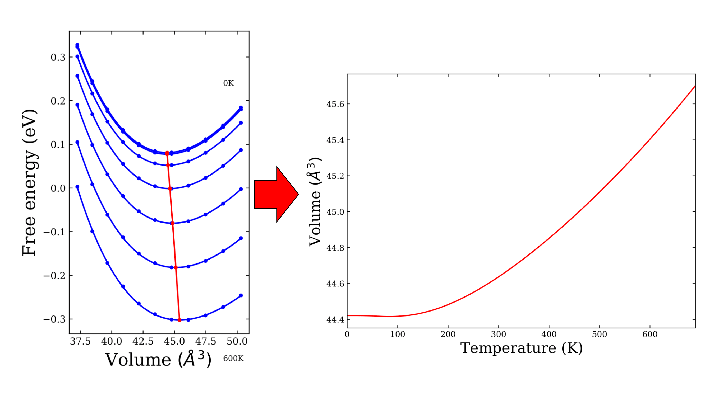

# Phonopy-qha Workflow

## Purpose
This workflow is designed to help you get started, or improve your workflow using phonopy-qha, the quasi-harmonic version of phonopy. Phonopy-qha takes into account volume expansion effects due to temperature by calculating thermal properties at different volumes from phonopy harmonic calculations. From this, more accurate temperature-dependent properties can be calculated versus temperature: volume, thermal expansion coefficient, bulk modulus, heat capacity, Gr\"uneisen parameter, phonon dispersion...

To illustrate this a little bit more, I have attached graphical representations of quantities obtained using phonopy and the quasi-harmonic approximation for Li3N. On the left, the free energy, _F(V, T)_, is approximated as the sum of the electronic internal energy, _U_el(V)_, and the phonon Helmholtz free energy, _F_ph(V, T)_. _U_el(V)_ is obtained from first principles electronic structure calculations at different volumes, _V_ , and _F_ph(V, T)_ is obtained from first principles lattice dynamics calculations at different _V_ and temperatures, _T_. _F(V, T)_ is plotted against volume for different temperatures from 0K to 690K in six steps of 100K and a final one of 90 K. The line connects
the lowest energy points at each temperature. This way, we are able to find the equilibrium volume at each temperature, which is shown on the right.

## Requirements
You must have previously performed convergence tests on your parameters and a geometry optimisation on your structure. You should also be confident in using the [phonopy workflow](phonopy). 

## Usage 
It is a three step process:
1. Generating an energy-volume curve by calculating the electronic internal energy, _U_el(V)_, at each volume _V_.
2. Performing phonon single point calculations at each volume to get the phonon Helmholtz free energy, _F_ph(V, T)_, at each volume _V_ and different temperatures _T_.
3. Post-processing using phonopy-qha.

### Mind Map
A typical workflow looks like this:

Please go to https://phonopy.github.io/phonopy/qha.html for more support.

### Scripts

### Going Furhter - thermal dependence of the phonon dispersion
There are three ways of obtaining the thermal dependence of the phonon dispersion
1. From your phonopy-qha calculations. If you had generated volumes that correspond to temperatures that are in the range of what you are looking for. This technique is, however, only useful if you do have calculated data for volumes that correspond to temperatures that are in the range of what you are looking for, which is unlikely unless carefully planned for. Even then, you might not end up with enough volumes, and you will not be able the calculate it for specific temperature. 
2. Redo phonon calculations at specific volumes that correspond to desired temperatures. This can be found in the `volume-temperature.*` data obtained from phonopy-qha. This technique is, however, computationally expensive and time-consuming.
3. Use my phonopy-gruneisen workflow that uses the data from the equilibrium volume, a larger volume, and a smaller volume, which you already have from phonopy-qha.

## INCAR & KPOINTS
For reference, I have also attached typical annotated INCAR and KPOINTS files used for the e-v curve calculation and for the single point calculations. For the e-v curve step, do not forget to set `ISIF = 4` in the INCAR to fix the volume. For the single point claculations, make sure to use `IBRION = -1` to avoid relaxing the structure, and `LREAL = .FALSE.` for accurate forces.

## Additional Resources
- [SUMO](https://github.com/ajjackson/sumo) to plot the thermal dependence of the phonon dispersions using the `--to-json` and `--from-json` functionalities.
- A comprehensive list of all phonopy setting tags: https://phonopy.github.io/phonopy/setting-tags.html.
- A comprehensive list of all phonopy command line options: https://phonopy.github.io/phonopy/command-options.html.
