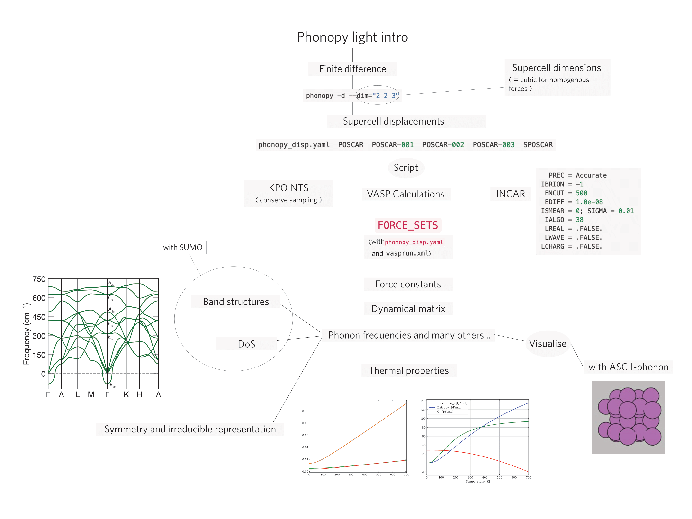

# Phonopy Workflow
## Purpose
This workflow is designed to help you get started, or improve your workflow using phonopy to calculate a number of exciting properties. This workflow uses a finite difference approach. I have ignored the Density Functional Perturbation Theory approach but more details can be found here: https://phonopy.github.io/phonopy/vasp-dfpt.html.

## Requirements
You must have previously performed convergence tests on your parameters and a geometry optimisation on your structure. 

## Usage 
### Mind Map
A typical workflow looks like this:

Please go to https://phonopy.github.io/phonopy/vasp.html for more support.

### Scripts
There are only two scripts needed for this workflow since most of it can be run from the command line:
- `fd.sh` distributes all POSCAR-XXX into single XXX directories with INCAR, KPOINTS, POTCAR, and job script files. I would recommend testing convergence on one structure first and then proceed with all the other ones.
- `clean_ph.sh` simply cleans irrelevant files from all sub-directories.

## INCAR & KPOINTS
For reference, I have also attached typical annotated INCAR and KPOINTS files used for a single point calculation. The most important aspects of the INCAR are `IBRION = -1` to avoid relaxing the structure, and `LREAL = .FALSE.` for accurate forces.

## Additional Resources
- [SUMO](https://github.com/ajjackson/sumo) to plot phonon dispersions and density of states.
- [ASCII-Phonons](https://github.com/ajjackson/ascii-phonons) for animations.
- A comprehensive list of all phonopy setting tags: https://phonopy.github.io/phonopy/setting-tags.html.
- A comprehensive list of all phonopy command line options: https://phonopy.github.io/phonopy/command-options.html.
- More theoretical background: _Introduction to Lattice Dynamics_ by Martin T. Dove + _Thermodynamics of Crystals_ by Duane C. Wallace.
